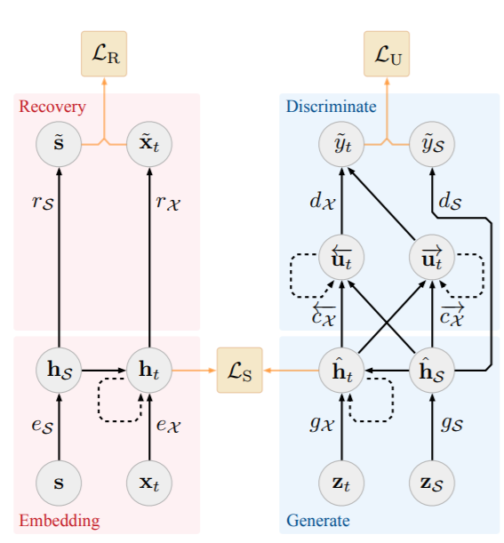

# Time Series GANs Practise

This repository contains the files and code to run a Jupyter container to generate synthetic time series data. This code has been manually adapted to Tensorflow 2.0 from the original 2019 release, which uses Tensorflow 1.15.

## Instructions
All the files and code are contenarised into a Docker Container. Docker is an open-source project that automates the development, deployment and running of applications inside isolated containers. Containers allow developers to bundle up an application with all of the parts it needs, such as libraries and other dependencies, and ship it as one package. To run the code, just introduce the next command and go to the next address http://localhost:40000/ (The password is "password". To be change in futher deployments): 

```bash
docker-compose up -d
```


## Basic Theory - [Time Series GANs](https://proceedings.neurips.cc/paper/2019/file/c9efe5f26cd17ba6216bbe2a7d26d490-Paper.pdf)
A good generative model for time series data should preserve temporal dynamics in the sense that new sequences respect the original relationships between variables over time. Existing methods that introduce generative adversarial networks (GANs)
into the sequential environment do not adequately account for the temporal correlations that are typical of time series data. At the same time, supervised models for sequence prediction, which provide finer control over network dynamics, are inherently
deterministic. TimeSeriesGANs is a novel framework for generating realistic time series data that combines the flexibility of the unsupervised paradigm with the control provided by supervised training. Using a learned embedding space optimized for both supervised and adversarial targets, we encourage the network to adhere to the dynamics of the training data during sampling. Empirically, we evaluate the ability of our method to generate realistic samples using a variety of
real and synthetic time series datasets. Qualitatively and quantitatively, we find that the proposed framework consistently and significantly outperforms state-of-the-art benchmarks in terms of similarity measures and predictive ability.




### Repository from original authors
- https://github.com/jsyoon0823/TimeGAN